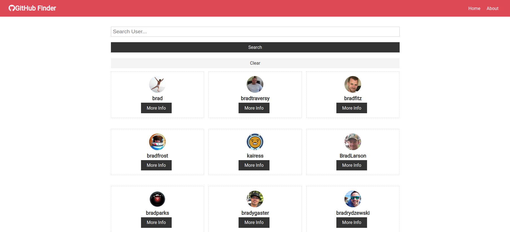

# GitHub Profile Finder

> Project was about using the GitHub API to pull GittHub profiles
> their 5 latest repost, information such as name, location, hireable and more
> 

## Built With

- NPM
- React
- React-DOM
- Redux
- CSS
- ES6

## Live Demo

[Live Demo Link](https://xenodochial-galileo-622b79.netlify.app/)

## Getting Started

**To get a copy of the code please click on the green button on the top right corner that says Code**

### Prerequisites

- Node installed on your computer
- Npm as well

### Install

**Now to clone it to your local machine please open your terminal and paste this code `git@github.com:cvilla714/react-redux-capstone.git`**

**Then you can go into the directory by typig `cd react-redux-capstone`**

**Finally just type this command `npm install` this will install all of the depnedecies for the project also you might need to run an extra command to get the latest version of each dependecy please run `npm audit fix`**

### Usage

**Once you have gone through the process of installing the code you now run this command `npm run start` this will start the app and a new window will open in your browser with the app ready to be use**

## Authors

👤 **Cosmel Villalobos**

- Github: [@cvilla714](https://github.com/cvilla714)
- Twitter: [@kckeyti](https://twitter.com/kckeyti)
- LinkedIn: [Cosmel Villalobos](https://www.linkedin.com/in/cosvilla/)

## 🤝 Contributing

Contributions, issues, and feature requests are welcome!

Feel free to check the [issues page](https://github.com/cvilla714/react-redux-capstone/pulls).

## Show your support

Give a ⭐️ if you like this project!

## Acknowledgment

- Microverse
- Marc-Antoine Roy on Behance

## 📝 License

This project is [MIT](https://github.com/cvilla714/react-redux-capstone/blob/development/LICENSE) licensed.
